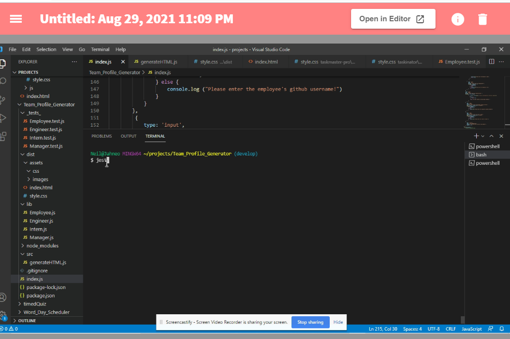

## Task
- # The title of the page**Object-Oriented Programming Team Profile Generator**
 
 

 # Project Description
 As a Manager a want a website that displays my team's basic information so that i have quick access to their emails and GitHub profiles. Given command line i can prompt for Managers name office number emails and for employee intern or student.

 # Installation
   - nmp init 
   - node index ( run program)
   - console.log(inquirer) ensure package was installed
    
   
 Install jest node inquirer and include function to write const fs = require ('fs');

 # Usage
 jest tests and node index.js

 

 # Contribution
 it optional

 # Test
 jest tests

 # Final
 [Final](./dist/assets/images/final_page.PNG)

 
    

 # Credit
 Thanks to README.md Generator for creating this README file

 # Questions
  If you have any questions, please contact  Neil Hall  the project owner by clicking on the email listed below.  
  
  
  #### [Jahneo@aim.com](mailto:Jahneo@aim.com)
   
